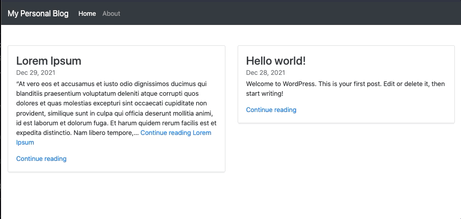

# PersonalBlog

This project was generated with [Angular CLI](https://github.com/angular/angular-cli) version 13.0.1.

## Front-end Interface Development server

Run `ng serve` or `ng serve --configuration=development` for a dev server. Navigate to `http://localhost:4200/`. The app will automatically reload if you change any of the source files.

## Front-end Interface Production server

Run `ng serve --configuration=production` for a prod server.

Run `ng build` to build the project. The build artifacts will be stored in the `dist/` directory.
## Front-end Interface Testing server

Run `ng serve --configuration=qa` for a testing server.

#### Running unit tests

Run `ng test` to execute the unit tests via [Karma](https://karma-runner.github.io).

#### Running end-to-end tests

Run `ng e2e` to execute the end-to-end tests via a platform of your choice. To use this command, you need to first add a package that implements end-to-end testing capabilities.

## Back-end WordPress API Development server

Run `docker-compose -f docker-compose.staging.yml up -d` to pull the containers for Wordpress and MySQL. Navigate to `http://localhost:8000/` and start the automated installation of the WordPress API.

## Back-end WordPress API Production server

Run `docker-compose -f docker-compose.prod.yml up -d` for a prod server.

## Back-end WordPress API Testing server

Run `docker-compose -f docker-compose.qa.yml up -d` for a testing server.

## Visual state of the project

